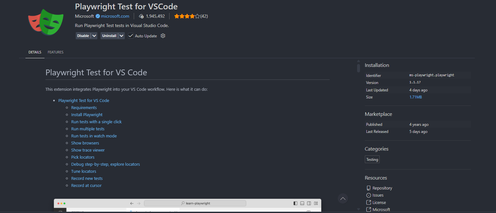
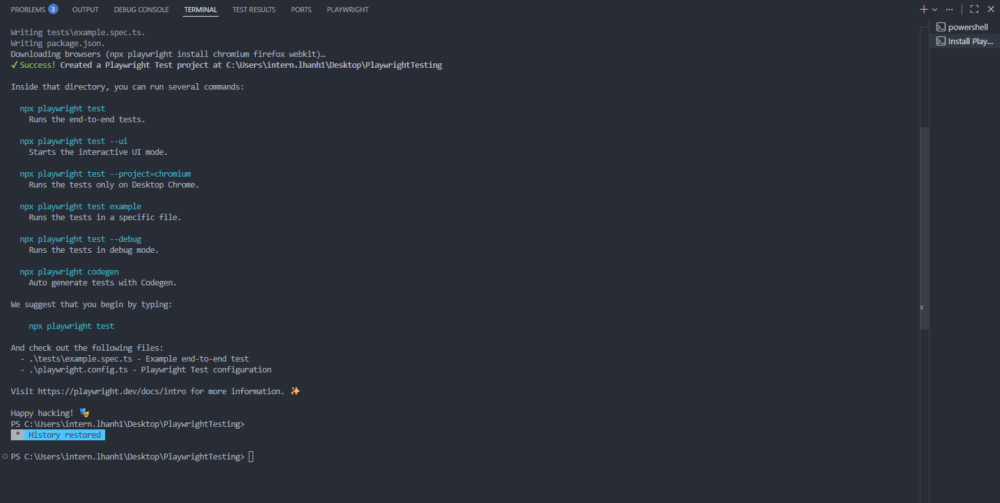
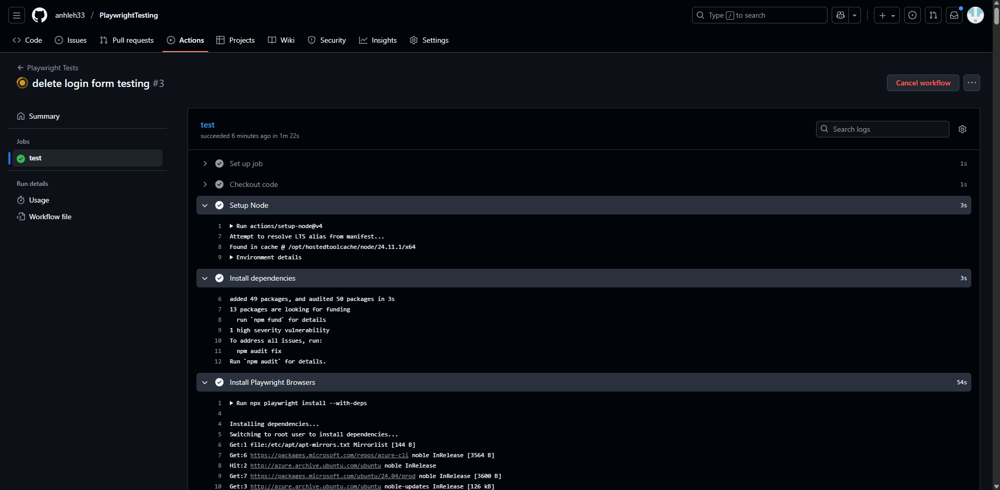

# ⚡Javascript
## Set up enviroment
- Install Nodejs
- Use Nodejs in command to run
```bash
node + name file
```
- [OPTIONAL] Using Quokka by search bar (">Quokka.js: New File")

## Jasmine for NodeJS
- Add Jasmine to your package.json
```bash
npm install --save-dev jasmine
```
- Initialize Jasmine in your project
```bash
npx jasmine init
```
- Set jasmine as your test script in your package.json (inside the main curly brackets)
```bash
"scripts": {
    "test": "jasmine"
}
```
Run your tests
```bash
npx jasmine
```
**⚠️ CAUTION:** Make sure that your Jasmine folder is correct (maybe "spec" and "your-project" are merged):
```bash
your-project/
│
├── package.json
│
├── spec/                     ← Jasmine looks here for test files
│   │
│   ├── support/              ← Jasmine config lives here
│   │   └── jasmine.json
│   │
│   └── example.spec.js       ← Your test files (*.spec.js)
│
└── src/                      ← (Optional) Your app code
    └── example.js
```

# 📝 Typescript
## Set up enviroment
- Install Typescript
```bash
npm install -D typescript
```

- Check version (make sure that Typescript was already installed)
```bash
npx tsc --version
```

- Use npx to compile ts file → js file
```bash
npx tsc (filename).ts
```
If you have a tsconfig.json, you simply run:
```bash
npx tsc
```
- Then use node to run the file like javascript
```bash
node (filename).js
```

# 🎭 Playwright
- In Extension of VS code, find Playwright and then install it


- In search bar, use command  and wait until it is setted up successfully (check in Terminal)
```bash
>Test: Install Playwright
```


- Push code to GitHub and check result of example to make sure that Playwright can be used immediately


- Run all cases
```bash
npx playwright test
```
